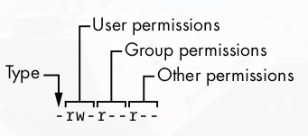

##### Standard Input and Output
Unix processes use I/O _streams_ to write and read data, data is read by processes from input streams and written to output streams. Streams are very flexible, the source of a input stream can be a file, a device, a terminal window or even the output stream from another process.

One can see input streams in action by using `cat`, and pressing enter, cat reads from standard input and standard input is connected to the terminal in which you run cat, thus repeating whatever one types.

> Pressing ctrl+D on a empty line stops the current standard input entry from the terminal with a EOF(end of file) messages(and often terminates the program) ctrl+C, terminates the program regardless of input or output.

The kernel gives each process a standard output to which it can write its output, the cat always write its output to standard output, in a terminal STDOUT is connected to the terminal. `stderror` also exists which is for writing errors.

###### Environment and Shell Variables
The shell can store temporary variables called shell variables, which contain values of text strings, and are used for scripts.

An _environment variable_ is like a shell variable, but not specific to the shell, all process on Unix systems have environment variable storage. The major difference is that the OS passes all environment variables to processes your shell runs, the same is not true for shell variables. Child processes inherit parent processes environment variables.
##### Shell Input and Output
To send the output of a command to a file use the `<` symbol
```
$ command > file
```
The shell creates the file if it doesn't exist and rewrites the file, to append use `>>`.

To send the standard output of a command to the standard input of another command use the `|` character.
```
$ head /proc/cpuinfo | tr a-z A-Z
```

To send standard error use `2>`.
###### Listing and Manipulating Processes

Each process has its own process ID (PID), for a quick list just run the `ps` command, the fields in the output mean the following.
- __PID__: Process ID
- __TTY__: The terminal device in which the process is running
- __STAT__: The process status, S means sleeping, R is running etc
- __TIME__: The amount of CPU time in minutes and seconds that the process has used so far.
- __COMMAND__: The command used to run the process.

> PIDs are unique for each process, however after termination of a process it can be reused.

Using `ps x`, shows all of your running process, `ps ax` shows all the processes on the system, `ps u` includes more info on processes, and `ps w`, shows full command names.

To terminate a process, one sends it a signal, using the kill command as follows
```
$ kill pid
```
The above command sends the `TERM` signal, to freeze a process one can use the STOP signal `kill -STOP pid`, a stopped process can be continued using the CONT signal `kill -CONT pid`. Using ctrl+C is the same as using the INT signal, also to forcefully close a process not allowing it to cleanup after itself one must use the KILL signal.

Using ctrl+Z, sends the STOP signal to a process, then typing `fg` into the terminal brings back to the foreground and `bg` resumes it in the background. To see any suspended process type in the `jobs` command.

Adding an ampersand at the end of the command keeps it running in the background while giving back the terminal shell to you
```
$ gzip file.gz &
```

Processes running in the background unless specified read from STDIN and write to STDOUT, which can result in interference of your work or the process not working as it read from stuff you were doing.

##### File Modes and Permissions
Every file has a set of permissions which can be displayed using `ls -l`, it looks something like this
![[../Images/Selection_1139.png]]
The files mode represents it permissions and is the one leftmost of the output, the meaning of the shit in the mode is represented best as follows
<div align="center">
  
</div>
A dash in the type means it is regular file, `r` means the file is readable, `w` means its writable and `x` means it is executable, `-` means that permissions has not been granted. The user permissions are for the owner of the file, the group permissions are for the files group and then for others

> `groups` command is used to check which groups one is in

Some files also have the `s` in the permissions which means the executable is _setuid_, which means on running it runs as the owner of the file, modifying permissions is simple one uses `chomd` followed by the letters of the type of permissions we want to change.

`g` for group, `o` for other and `u` for user, then a plus followed by the letters of the permissions one wants to add followed by the filename. Use minus sign to remove permissions.

For a directory, one can only list it if it is readable, and access the files in it only if the directory is executable.

`umask` helps one define a default for all the files we create, `umask 022` makes every file and directory you make observable to everyone and `umask 077` makes it not observable.

##### Symbolic Links
Symbolic Links are like shortcuts on windows and point to the files they link to, symbolic links can also be chained, they are created using the following command
```
$ ln -s target linkname
```

##### Linux Directory Hierarchy
The following are the directories in the root directory
- `/bin`: contains the ready to run programs.
- `/dev`: Contains device files
- `/etc`: Contains core system configuration files
- `/home`: Holds personal directories for regular users
- `/lib`: Contains library files which executables can use 
- `/proc`: Provides system statistics through a directory and file interface.
- `/run`: Contains runtime data for the system, some PIDs, socket files some logging
- `/sys`: Similar to proc and provides a device and system interface
- `/sbin`:  System executables
- `/tmp`: Used for temporary files
- `/user`: It has no user files contrary to its name, and is similar to the root directory
- `/var`: Records information, system logging, user tracking, caches etc.
- `/boot`: Contains kernel boot loader files
- `/media`: Base attachment point for flash drives and stuff
- `/opt`: Contains third party software.
